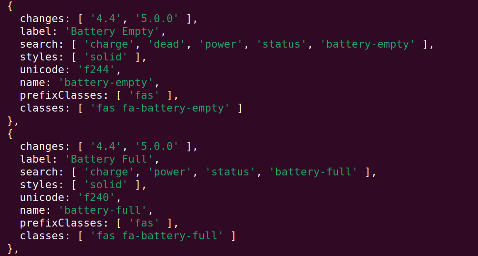

# Fontawesome 5 Icons List

## About

A package to get all icons name from fontawesome free version

## Features And Props

- all icons list
- get icon by search
- get special icons style

## Installation

**Note**: You can use _yarn_ or _npm_ as a package manager, here i'm using _yarn_

```bash
yarn add fontawesome-5-icons-list
```

## Example Output



## Usage

### Get All

```js
// the whole list without any filtering
const { all } = require("fontawesome-5-icons-list");
console.log(all); // array of objects contains the icons informations
```

### Search

```js
// list of searched icons
const { search } = require("fontawesome-5-icons-list");
console.log(search("home")); // array of objects contains the icons informations
```

### Get Icons By Style

```js
// list of icons based on searched style (brands, solid, regular)
const { iconsListByStyle } = require("fontawesome-5-icons-list");
console.log(iconsListByStyle("regular")); // array of objects contains the icons informations with regular style
```

## Changelog

[read from here](./CHANGELOG.md)

## LICENSE

[MIT](./LICENSE)
